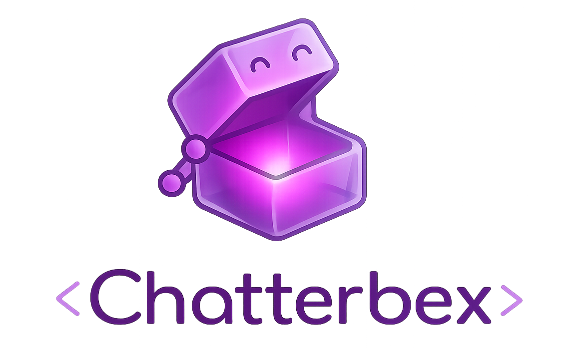

<p align="center">
  
</p>

<p align="center">
  <a href="https://github.com/holsee/chatterbex/actions/workflows/ci.yml"></a>
  <a href="https://hex.pm/packages/chatterbex"></a>
  <a href="https://hexdocs.pm/chatterbex"></a>
  <a href="https://github.com/holsee/chatterbex/blob/main/LICENSE"></a>
</p>

# Chatterbex

Elixir wrapper for [Chatterbox TTS](https://github.com/resemble-ai/chatterbox) - state-of-the-art text-to-speech models from Resemble AI.

## Features

- Zero-shot voice cloning
- Three model variants:
  - **Turbo** (350M params) - Low-latency English TTS with paralinguistic tags
  - **English** (500M params) - High-quality English with CFG controls
  - **Multilingual** (500M params) - 23+ languages support
- Simple Elixir API via GenServer

## Requirements

- Elixir 1.14+
- Python 3.10 or 3.11 (3.12+ not supported)
- CUDA GPU, Apple Silicon (MPS), or CPU
- `chatterbox-tts` Python package

## Installation

1. Add `chatterbex` to your dependencies in `mix.exs`:

```elixir
def deps do
  [
    {:chatterbex, "~> 0.1.0"}
  ]
end
```

2. Install the Python dependencies:

```bash
mix chatterbex.setup
```

Or manually:

```bash
pip install chatterbox-tts
```

### Setup Options

```bash
# CUDA (NVIDIA GPU)
mix chatterbex.setup --cuda

# Apple Silicon (M1/M2/M3/M4)
mix chatterbex.setup --mps

# CPU-only (no GPU required, smaller download)
mix chatterbex.setup --cpu

# Use a virtual environment
mix chatterbex.setup --mps --venv .venv
```

## Usage

### Basic Text-to-Speech

```elixir
# Start a Turbo model server
{:ok, pid} = Chatterbex.start_link(model: :turbo)

# Generate speech
{:ok, audio} = Chatterbex.generate(pid, "Hello, world!")

# Save to file
:ok = Chatterbex.save(audio, "output.wav")
```

### Voice Cloning

Provide a reference audio file (10 seconds recommended) for voice cloning:

```elixir
{:ok, audio} = Chatterbex.generate(pid, "Hello in your voice!",
  audio_prompt: "path/to/reference.wav"
)
```

### Paralinguistic Tags (Turbo Model)

The Turbo model supports embedded emotional expressions:

```elixir
{:ok, audio} = Chatterbex.generate(pid, "That's hilarious [laugh] I can't believe it!")
```

Available tags: `[laugh]`, `[chuckle]`, `[cough]`, `[sigh]`, `[gasp]`, `[groan]`, `[yawn]`, `[sniff]`, `[clearing_throat]`

### Multilingual Support

```elixir
{:ok, pid} = Chatterbex.start_link(model: :multilingual)

# French
{:ok, audio} = Chatterbex.generate(pid, "Bonjour, comment allez-vous?", language: "fr")

# German
{:ok, audio} = Chatterbex.generate(pid, "Guten Tag, wie geht es Ihnen?", language: "de")

# Chinese
{:ok, audio} = Chatterbex.generate(pid, "你好，今天天气真不错", language: "zh")
```

### Model Options

```elixir
# Use Apple Silicon GPU (MPS)
{:ok, pid} = Chatterbex.start_link(model: :turbo, device: "mps")

# Use CPU instead of GPU
{:ok, pid} = Chatterbex.start_link(model: :english, device: "cpu")

# English model with exaggeration control
{:ok, audio} = Chatterbex.generate(pid, "This is exciting!",
  exaggeration: 0.7,
  cfg_weight: 0.5
)
```

### Named Servers

```elixir
# Start with a name for easy access
{:ok, _pid} = Chatterbex.start_link(model: :turbo, name: MyApp.TTS)

# Use anywhere in your app
{:ok, audio} = Chatterbex.generate(MyApp.TTS, "Hello!")
```

## Configuration

| Option | Description | Default |
|--------|-------------|---------|
| `:model` | Model variant (`:turbo`, `:english`, `:multilingual`) | `:turbo` |
| `:device` | Compute device (`"cuda"`, `"mps"`, `"cpu"`) | `"cuda"` |
| `:name` | GenServer name | `nil` |

## Generation Options

| Option | Model | Description |
|--------|-------|-------------|
| `:audio_prompt` | All | Path to reference audio for voice cloning |
| `:language` | Multilingual | Language code (e.g., "fr", "de", "zh") |
| `:exaggeration` | English | Expression intensity (0.0 - 1.0) |
| `:cfg_weight` | English | Classifier-free guidance weight |

## Supported Languages

The multilingual model supports: English, French, German, Spanish, Italian, Portuguese, Dutch, Polish, Russian, Ukrainian, Czech, Slovak, Hungarian, Romanian, Bulgarian, Croatian, Slovenian, Serbian, Macedonian, Albanian, Turkish, Arabic, Hebrew, Chinese, Japanese, Korean, Vietnamese, Thai, Indonesian, Malay.

## Architecture

Chatterbex uses Erlang ports to communicate with a Python process running the Chatterbox models. Each `Chatterbex.start_link/1` call spawns a dedicated Python process with the loaded model, allowing multiple models or instances to run concurrently.

```text
+---------------+      JSON/stdin       +-----------------+
|    Elixir     | --------------------> |     Python      |
|   GenServer   |                       | Chatterbox TTS  |
|               | <-------------------- |                 |
+---------------+    Base64 WAV/stdout  +-----------------+
```

## Examples

See the [examples](examples/README.md) directory for runnable scripts:

- **[hello_world.exs](examples/hello_world.exs)** - Basic text-to-speech
- **[voice_cloning.exs](examples/voice_cloning.exs)** - Clone a voice from reference audio
- **[multilingual.exs](examples/multilingual.exs)** - Generate speech in 23+ languages

```bash
mix run examples/hello_world.exs --text "Hello" --device mps
mix run examples/voice_cloning.exs --reference voice.wav
mix run examples/multilingual.exs --text "Bonjour" --language fr
```

## Documentation

- [Examples README](examples/README.md) - Detailed usage for all examples
- [Architecture Decision Records](docs/adr/README.md) - Design decisions and rationale

## License

MIT License - See [LICENSE](LICENSE) for details.

## Acknowledgments

- [Resemble AI](https://www.resemble.ai/) for the Chatterbox TTS models
- The Elixir community
